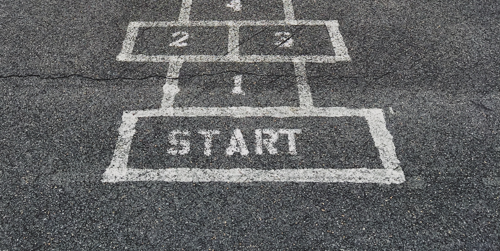
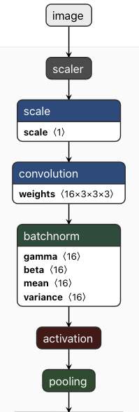

# Detect hands on an image. Create and train CoreML model from scratch

*<span>Photo by <a href="https://unsplash.com/@jontyson?utm_source=unsplash&amp;utm_medium=referral&amp;utm_content=creditCopyText">Jon Tyson</a> on <a href="https://unsplash.com/s/photos/hopscotch?utm_source=unsplash&amp;utm_medium=referral&amp;utm_content=creditCopyText">Unsplash</a></span>*

In this tutorial we will detect a hand on an image on iPhone. To do this we will create an object detection CoreML model using the TuriCreate toolkit.

## Preconditions

1) Install Python
    
    a) For *MacOS* install brew and python3:
    ```console
    > /usr/bin/ruby -e "$(curl -fsSL https://raw.githubusercontent.com/Homebrew/install/master/install)"
    > brew install python3
    ```
    b) For *Windows* download and install [Python](https://www.python.org/downloads/windows/)

**NOTE:** To create this tutorial the `Python 3.7.7` was used.

2) Install `pip` and create Python virtual environment using `venv`. For *Windows* follow instructions on the page and switch to the step 5) in this guide: [Python Environment](https://packaging.python.org/guides/installing-using-pip-and-virtual-environments/). For *MacOS* follow the following steps.

3) On *MacOS* for convenience the following lines may be added to `/Users/username/.bash_profile`
```zsh
alias python=python3
alias pip=pip3
export WORKON_HOME=~/.virtualenvs
mkdir -p $WORKON_HOME
. /usr/local/bin/virtualenvwrapper.sh
```

After that run the following command to apply bash profile: 
```zsh
> source /Users/username/.bash_profile
```

`username` should be replaced with yours one of course.

3) Next step is to create a virtual environment:

```zsh
> python3 -m venv ml
```

`ml` above is the name of Python environment where all needed dependencies will be installed

4) The final step before starting to use an environment is to activate it:

```zsh
> source ~/.virtualenvs/ml/bin/activate
```

5) Install TuriCreate and Core ML tools. This step should be done in the active Python environment created previously:
```zsh
(ml)> pip install -U turicreate
(ml)> pip install -U coremltools
```

6) Download [EgoHands](http://vision.soic.indiana.edu/projects/egohands/) and unarchive it to the root folder of this repository.

7) This step is an optional one. Install [VS Code](https://code.visualstudio.com/). Any other IDE or even a text editor might be used instead.

1) [TuriCreate](https://github.com/apple/turicreate) toolkit simplifies ML models creation process and makes it almost trivial. TuriCreate supports several neural network model types. For our needs we are going to use model type called [ObjectDetector](https://apple.github.io/turicreate/docs/userguide/object_detection/) to do labeling and localization tasks.
2) Before starting to use a neural network it should be trained on so called a train data set which is prepared beforehand in a special way.
3) Usually the training step takes a lot of time and requires powerful computing resources. To tackle this problem TuriCreate does a trick. It downloads already pre-trained neural network model and uses it to do final training based on the users data. This step is also called fine-tuning.
4) In our case TuriCreate will use pre-trained Darknet-YOLO which is a fast, mid size network that should be suitable for a mobile application.
5) As mentioned above before starting to train the data which is formed by a list of images should be prepared in a special way as such each image should be annotated. That means we need to define a bounding box around each of the target object a hand in our case on each image in the dataset. Each bounding box should be associated with a label.
6) In our case we have two types for labeling that correspond to either the left or the right hand.
7) In this tutorial we will not prepare a train data set from the scratch but we will use the one from [EgoHands](http://vision.soic.indiana.edu/projects/egohands/)
8) Describe briefly the repo structure and a structure of EgoHands data set
9) Prepare a training data and visualize an example of ground truth data
10) Run a script to create and train a network model
11) To investigate the result CoreML model deeper we can open it in the Neutron viewer:
<p align="center">
  
</p>
Each block on the picture above corresponds to a simple operation on the matrix or vector. The output from one block is used as an input for rhw other which forms a pipeline. The end of this pipeline gives us a output from the model.
12) Discuss a training process and the result. Mean average precision.
13) Run a script to visualize a result of training. Mention an image resizing step.
14) Describe briefly how to add a newly created CoreML model into iOS app
15) Describe how to use a pixel buffer which an output from the camera with CoreML.
16) Describe briefly how to use Vision request to reduce computational complexity by reducing an amount of CoreML requests.
*TO BE CONTINUED...*